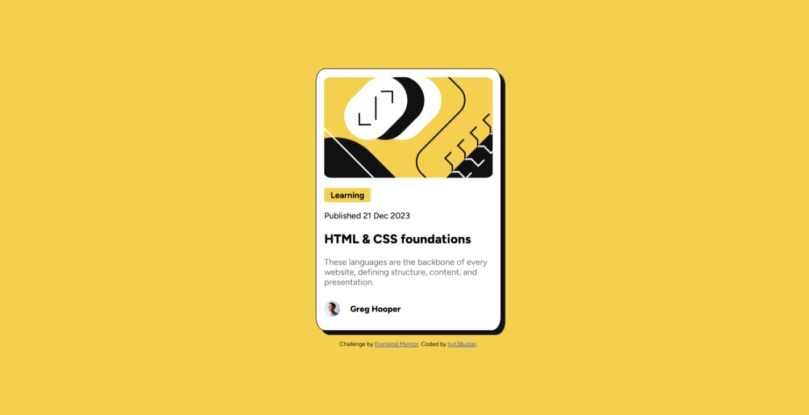
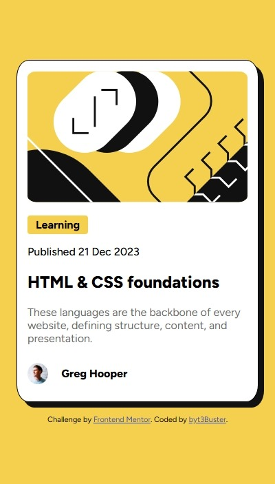

# Frontend Mentor - Blog preview card solution

This is a solution to the [Blog preview card challenge on Frontend Mentor](https://www.frontendmentor.io/challenges/blog-preview-card-ckPaj01IcS). Frontend Mentor challenges help you improve your coding skills by building realistic projects. 

## Table of contents

- [Overview](#overview)
  - [The challenge](#the-challenge)
  - [Screenshot](#screenshot)
  - [Links](#links)
- [My process](#my-process)
  - [Built with](#built-with)
  - [What I learned](#what-i-learned)
- [Author](#author)
- [Acknowledgments](#acknowledgments)

## Overview

### The challenge

Users should be able to:

- See hover and focus states for all interactive elements on the page

### Screenshot

Desktop screenshot :

Mobile screenshot :

### Links

- Solution URL: [https://www.frontendmentor.io/challenges/blog-preview-card-ckPaj01IcS](https://www.frontendmentor.io/challenges/blog-preview-card-ckPaj01IcS)
- Live Site URL: [https://blog-preview-card-main-lovat.vercel.app/](https://blog-preview-card-main-lovat.vercel.app/)

## My process

### Built with

- Semantic HTML5 markup
- CSS custom properties
- Flexbox

### What I learned

I learned to integrate the police files (.ttf) in the web pages. I improved my skills in terms of design thanks to this projet. When i applied a max-width: 320px; to my main, the image overflowed, it was pludit that i noticed that it was necessary to adapt the width of the image to that of the main(the parent). THANKS Front End Mentor COMMUNITY !!! 

## Author

- Frontend Mentor - [@byt3Buster](https://www.frontendmentor.io/profile/byt3Buster)
